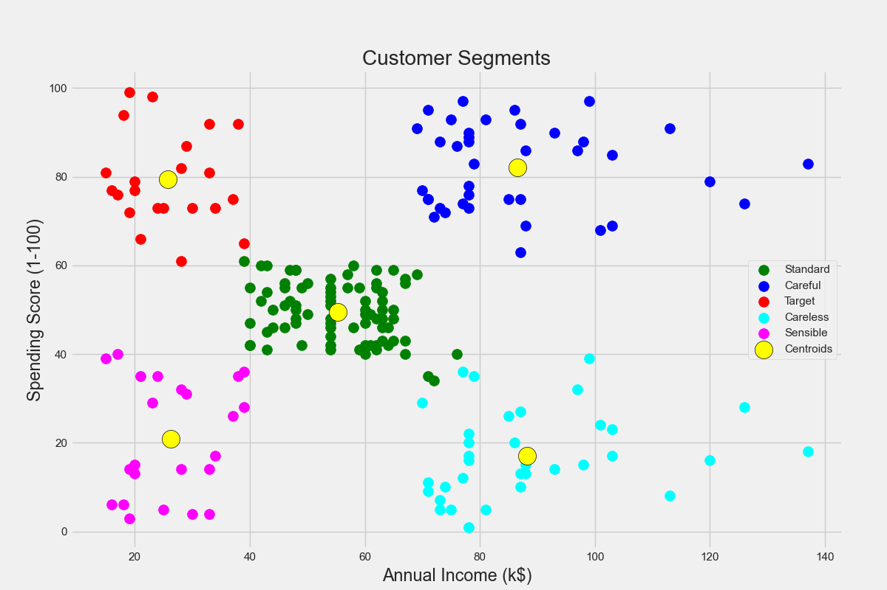
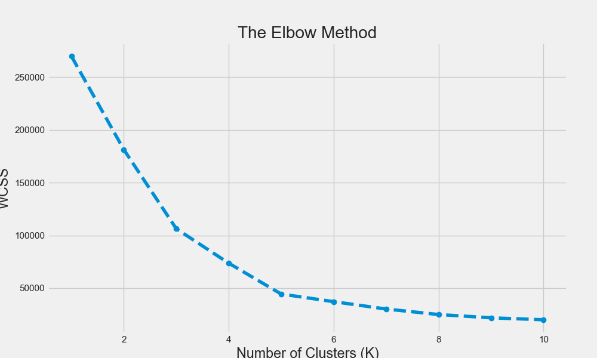

# Customer Segmentation using K-Means Clustering 🛍️

## Project Overview

This project uses unsupervised machine learning to segment customers based on their shopping behavior. By applying the **K-Means clustering algorithm** to a dataset of mall customers, we can identify distinct groups and better understand their profiles. This kind of analysis is crucial for targeted marketing and business strategy.

---

## Key Visualizations

### 1. Final Customer Segments

This is the main output of the project. The scatter plot below shows the five distinct customer groups identified by the K-Means algorithm based on their income and spending score.



### 2. The Elbow Method

To determine the optimal number of groups for the customer data, the Elbow Method was used. The chart below shows that the "elbow" point occurs at K=5, indicating that five is the ideal number of clusters.



---

## Interpreting the Segments

The analysis revealed five distinct customer segments:
-   **High Income, Low Spenders (Careful):** Earn a lot but spend little.
-   **High Income, High Spenders (Targets):** The prime target for marketing.
-   **Mid Income, Mid Spenders (Standard):** A large, average group.
-   **Low Income, Low Spenders (Sensible):** Spend cautiously.
-   **Low Income, High Spenders (Careless):** Potential for credit offerings but high risk.

---

## Technology Stack
- **Python**
- **Pandas** for data manipulation and analysis.
- **Matplotlib & Seaborn** for data visualization.
- **Scikit-learn** for implementing the K-Means algorithm.
- **Jupyter Notebook** as the development environment.

---

## Setup and Installation Instructions

To run this project on your local machine, follow these steps:

1.  **Clone the Repository:**
    ```bash
    git clone [https://github.com/YourUsername/Customer-Segmentation-KMeans.git](https://github.com/YourUsername/Customer-Segmentation-KMeans.git)
    cd Customer-Segmentation-KMeans
    ```

2.  **Create and Activate a Virtual Environment:**
    * It's highly recommended to use a virtual environment to keep dependencies organized.
    ```bash
    # Create the environment
    python -m venv venv

    # Activate on Windows
    .\venv\Scripts\activate

    # Activate on macOS/Linux
    source venv/bin/activate
    ```

3.  **Install Required Libraries:**
    * The `requirements.txt` file contains all the necessary libraries.
    ```bash
    pip install -r requirements.txt
    ```

4.  **Launch Jupyter Notebook:**
    ```bash
    jupyter notebook
    ```
5.  Open the `customer_segmentation.ipynb` file from the Jupyter interface in your browser.

---

## Methodology

1.  **Data Exploration:** Loaded the dataset and performed an initial exploratory data analysis (EDA).
2.  **Feature Selection:** Selected 'Annual Income' and 'Spending Score' as the key features for clustering.
3.  **Finding Optimal K:** Used the **Elbow Method** to determine that 5 is the optimal number of clusters.
4.  **Clustering:** Trained a K-Means model with K=5 to segment the customers.
5.  **Visualization:** Plotted the clusters and their centroids to visualize the different segments.

---

## License

This project is distributed under the MIT License. See the `LICENSE` file for more information.
